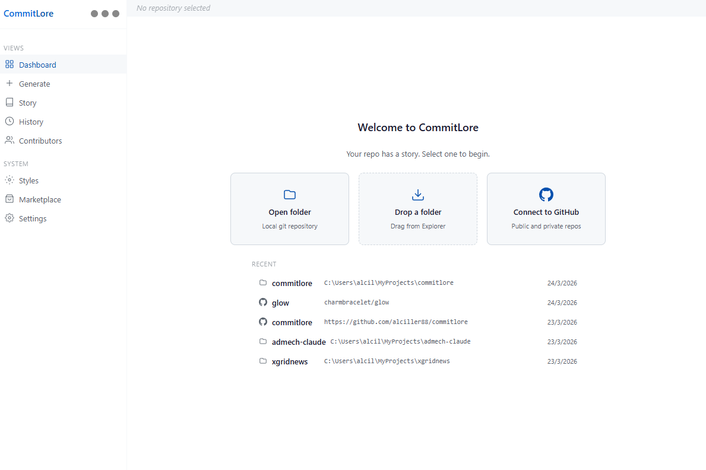
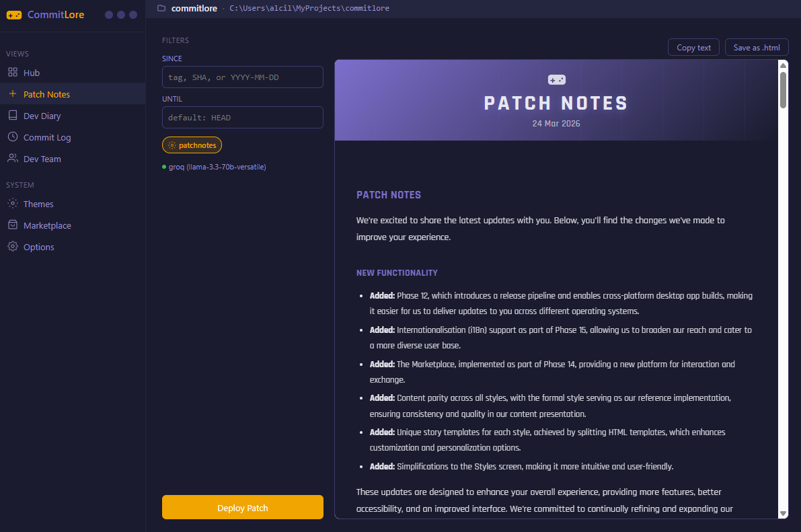
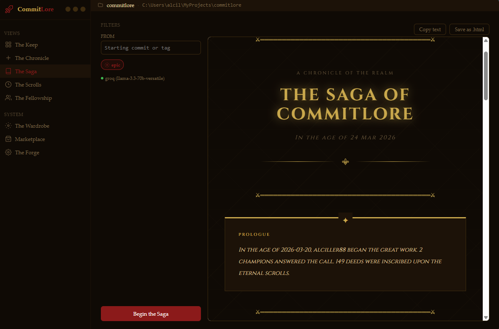
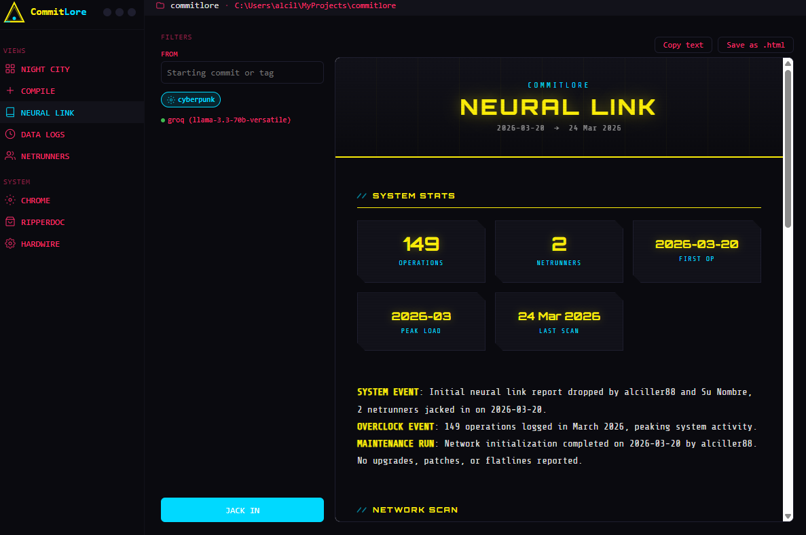
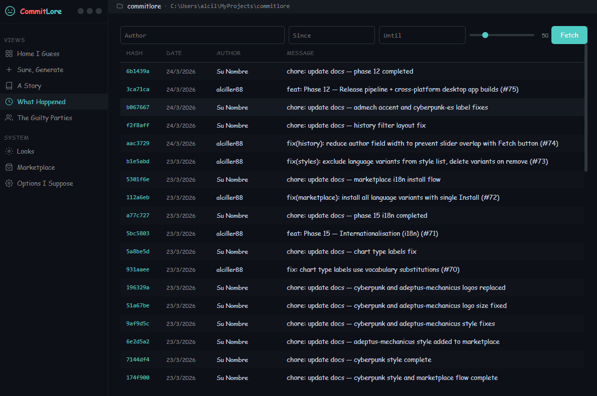
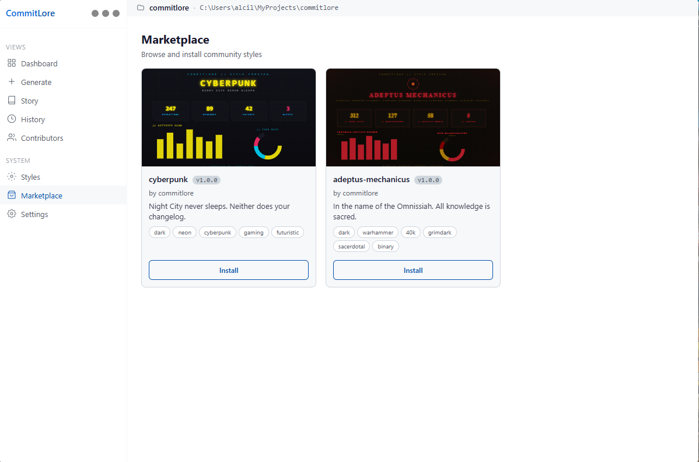
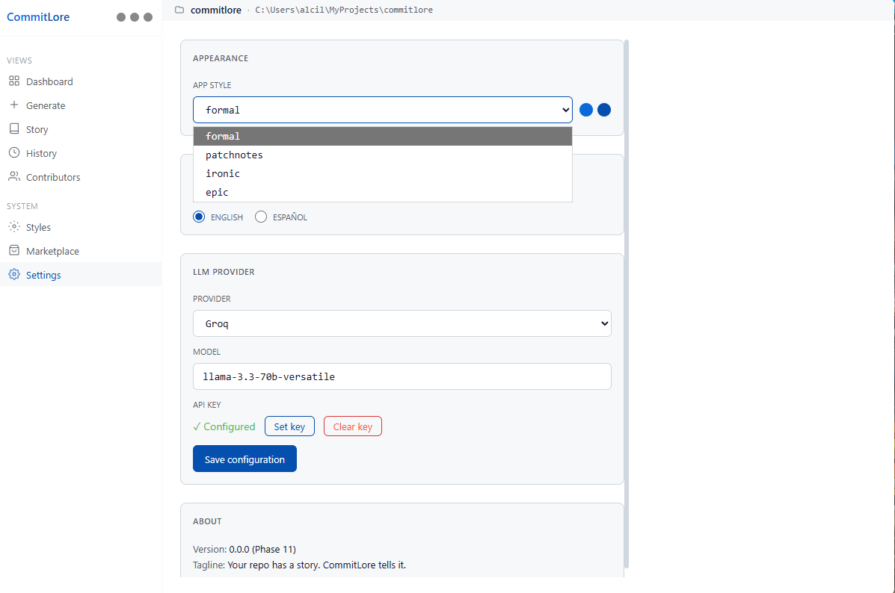

<!-- logo placeholder -->

[](https://github.com/alcil/commitlore/actions/workflows/ci.yml)

[](LICENSE)

> Your repo has a story. CommitLore tells it.

CommitLore is a cross-platform tool (CLI + desktop app) written in Go that analyzes git repositories -- local and remote via GitHub -- and generates changelogs, narratives, and contributor reports. It works offline with no API key or account required, supports optional LLM enrichment when configured, and ships with a modular style system that controls tone, templates, and visual identity. Output formats include terminal, Markdown, JSON, and self-contained HTML.

## Features

- Generate changelogs and repo narratives without an API key or internet connection
- Explore commit history filtered by author, date range, or tag
- Map contributor activity across the codebase with per-file breakdowns
- Switch between four built-in styles (formal, patchnotes, ironic, epic) or create your own
- Optionally enrich output with LLM providers (Anthropic, OpenAI, Ollama, Groq) -- always off by default
- Export to terminal, Markdown, JSON, or standalone HTML with Chart.js visualizations
- Analyze local repositories or public/private GitHub repos

## Screenshots

### Dashboard


### Generate — Patchnotes style


### Story — Epic style


### Story — Cyberpunk style


### History — Ironic style


### Marketplace


### Settings


## Quick Start

### Install

> See [Releases](https://github.com/alcil/commitlore/releases).

### Usage

```bash
commitlore generate --repo . --since v0.3.0 --style epic --format terminal
```

Example output (illustrative):

```
═══════════════════════════════════════════════════
  THE CHRONICLE OF COMMITLORE — v0.3.0 to HEAD
═══════════════════════════════════════════════════

  ✦ feat: add contributor activity breakdown
  ✦ feat: support GitHub remote repositories
  ✔ fix: correct date parsing for --since flag
  ✔ fix: handle empty tag ranges gracefully
  ⚙ chore: update CI pipeline for cross-platform builds

  3 contributors  |  12 commits  |  5 tags

═══════════════════════════════════════════════════
```

## Built-in Styles

| Style | Aesthetic | Description |
|-------|-----------|-------------|
| **formal** | Neutral, professional | Technical tone, neutral colors, Inter font |
| **patchnotes** | Video game updates | Purple/gold palette, Rajdhani font, animations |
| **ironic** | Dry humor | Coral/teal palette, Comic Sans, Clippy references |
| **epic** | Medieval narrative | Grand tone, gold/dark palette, Cinzel font, ornate decorators |

## Optional LLM Integration

LLM support is entirely optional. Without it, CommitLore uses templates and vocabulary substitutions from the active style to produce output. When an API key is configured, the style's `llm_prompt` field instructs the model, with built-in anti-hallucination directives that require output to be based exclusively on provided commit data. Supported providers: `anthropic` (Claude), `openai` (GPT), plus convenience aliases `ollama` (local, `localhost:11434`) and `groq` (cloud). Any OpenAI-compatible endpoint works via `--llm openai --llm-base-url <url>`.

## Desktop App

CommitLore includes a native desktop app (Wails v3 + Svelte) with screens for dashboard, changelog generation, story narrative, commit history, contributor mapping, style browsing, and LLM settings. API keys are stored in the OS keychain and never written to disk in plaintext.

> Download from [Releases](https://github.com/alcil/commitlore/releases).

## Style System

Styles are `.shipstyle` files in YAML format that define tone, text templates, vocabulary, theme colors, typography, terminal decorators, and full HTML templates. They are stored in `~/.config/commitlore/styles/` (Windows: `%APPDATA%\commitlore\styles\`) and managed via `commitlore style list|show|create|import|export|delete`. Custom styles can be shared as standalone files.

<!-- Link to style authoring docs: TBD -->

## Contributing

CommitLore is at v0.0.0 (pre-release). The specification lives in [SPEC.md](SPEC.md) and project context in [CONTEXT.md](CONTEXT.md) -- read both before contributing. File issues for bugs or proposals; PRs should align with the current development phase described in SPEC.md.

## License

MIT — see [LICENSE](LICENSE) for details.
